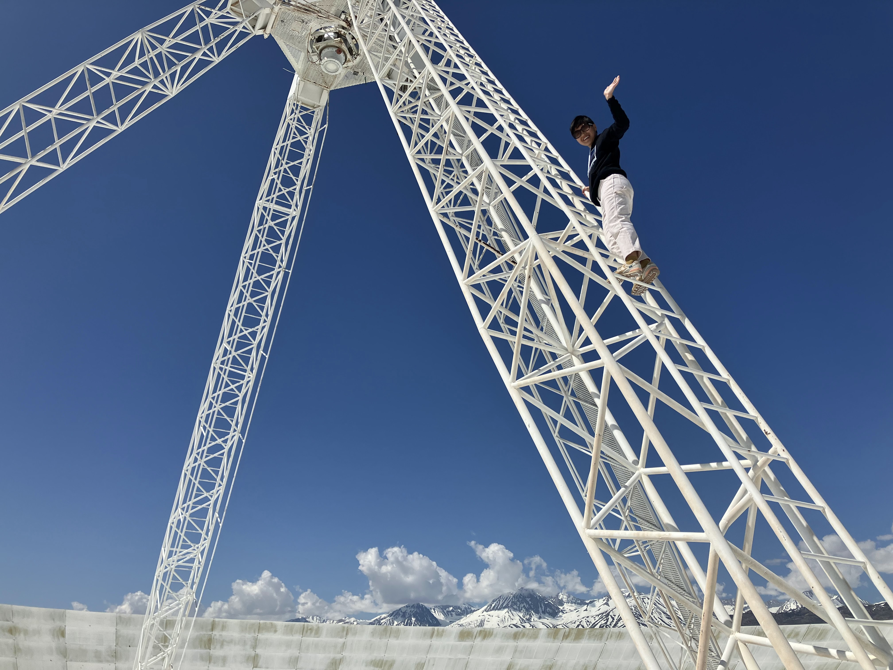

  <figure>
     

 <figcaption> <em> Photo taken by Danny Jacobs. </em>  </figcaption>
     

  </figure>
 

I'm Yifan Zhao, an astronomer and an instrumentalist specializing in 21-cm cosmology. I also go by Amy. I received my B.S. in Physics from Carnegie Mellon University in 2020. I'm currently a Ph.D. candidate at Arizona State University.

## Selected talks and publications

Zhao, Y., Bell, J. F., III, Sahr, E., Lessac-Chenen, E., Adam, C., Cisneros, E., et al. (2024). Pre-flight and in-flight calibration and performance of the Terminal Tracking Cameras (TTCams) on the NASA Lucy mission. Earth and Space Science, 11, e2024EA003576. <a href="https ://doi.org/10.1029/2024EA003576">doi.org/10.1029/2024EA003576</a>

Zhao, Y., Jacobs, D. C., Bowman, J., Samson, T. and Lalonde, M.-O. R. Pathfinding Low Frequency Radio Astronomy with the DORA Radio Background Experiment. 2025 IEEE Aerospace Conference, Big Sky, Montana. [submitted, expected Mar 2025.]

“Space-like testing of 21-cm cosmology instruments on balloons and beyond.” National Radio Science Meeting (URSI), University of Colorado Boulder.

## Teaching and outreach

The <b>LoCo Lab Radio Astronomy Bootcamp</b> is a summer week-long bootcamp run by the <a href="https://loco.lab.asu.edu/">Low-Frequency Cosmology (LoCo) Lab</a> at Arizona State University for undergraduate students interested in learning more about radio astronomy or in working for the LoCo Lab. I have helped to develop the teaching materials and led sessions at the 2023 version of this bootcamp.

The <b>Completely Hackable Amateur Radio Telescope (CHART)</b> is an outreach program developed in collaboration between Arizona State University and Winona State University that aims to teach high schoolers about DIY radio astronomy. I have mentored undergraduate students on the development and testing of this project. Read more <a href="https://astrochart.github.io/main_page">here</a>.

I've also TA'd for summer programs such as the <a href="https://summerscience.org/">Summer Science Program</a> and for undergraduate courses at ASU, including SES 410: Senior Exploration Project.

## Links
<a href="graphics/YifanZhaoCV.pdf">CV</a>
<a href="https://orcid.org/0009-0005-2028-2345">Publications<a>
