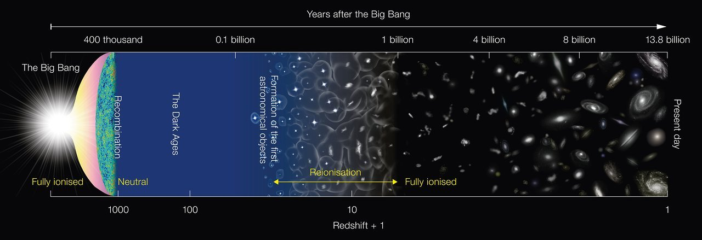
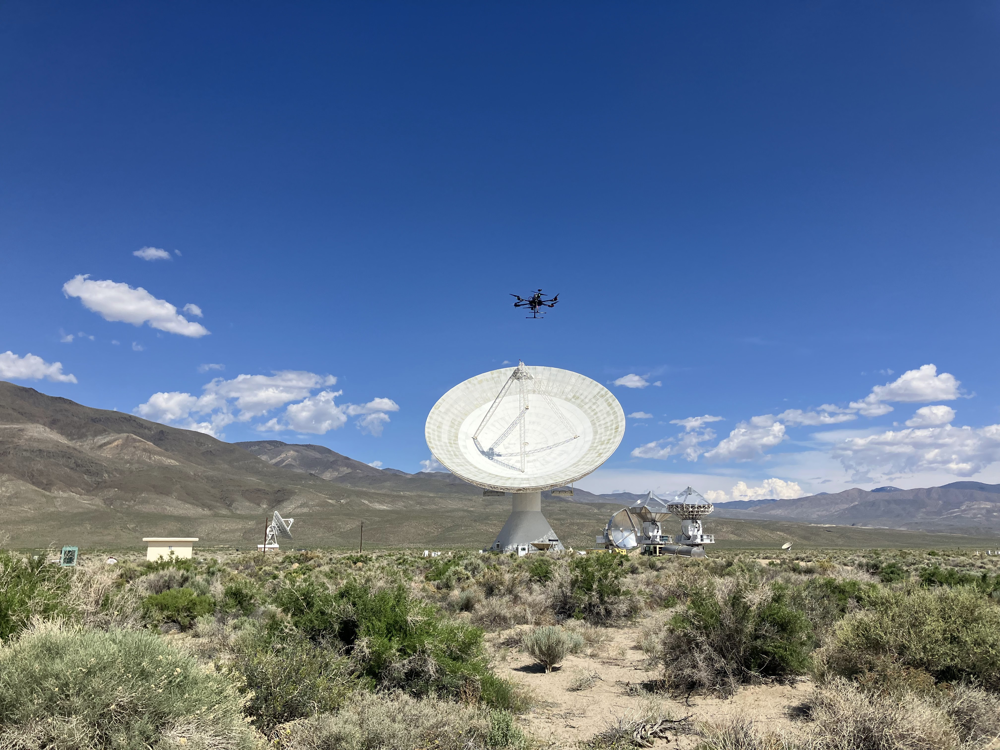

<figure>

<figcaption> <em> The 40m telescope at the Owen's Valley Radio Observatory. (photo by Danny Jacobs) </em>

</figure>

## Research

My research is instrumentation-focused, with a heavy learning towards early universe radio astronomy. Specifically, I look at neutral hydrogen from the Epoch of Reionization.

<figure>

<figcaption> <em> A look at the cosmological timeline, from the Big Bang to the present day. (image via NAOJ) </em>

</figure>

I work on a couple instrumentation projects in this field, including DORA and ECHO. I have also worked on optical instrumentation with the Terminal Tracking Cameras (TTCams) on the NASA Lucy mission.

## The Deployable Optical Receiver Array (DORA)

<figure>

<figcaption> <em> DORA team members with the completed satellite on 28 March 2024. (from left) Quang Huy Dinh, Sid Vaidy, Dylan Larson, Marc-O Lalonde, Chandler Hutchens, Sam Cherian, Athul Kodancha, Amy Zhao, Ben Weber, Daniel Jacobs, Titu Samson. (photo by Sam Cherian) </em>  </figcaption>

</figure>

DORA is a joint venture between ASU's Interplanetary Lab (IPL) and the LoCo Lab. The IPL was responsible for the design, build, and testing of the spacecraft, while the LoCo Lab designed and built the guest payload, a low-frequency radio spectrum survey experiment. DORA's Radio Background Experiment aims to characterize the RFI environment in low-Earth orbit as a pathfinder experiment for future space-based 21-cm cosmology experiments.

## The External Calibrator for Hydrogen Observatories (ECHO)

<figure>

<figcaption> <em> The ECHO drone on a field trip to the Owen's Valley Radio Observatory. (photo by Danny Jacobs) </em>  </figcaption>

</figure>

One of the biggest limitations of instrument sensitivity in 21-cm cosmology is knowledge of the antenna response, or beam. ECHO is a drone project that aims to make a beam map of low-frequency radio arrays. Read more <a href="https://dannyjacobs.github.io/ECHO/">here<\a>.

## The Terminal Tracking Cameras (TTCams) on the Lucy Mission

The <a href="https://lucy.swri.edu/">NASA Lucy Discovery mission</a>, launched in October 2021, is the first mission to the Trojan asteroids, which are regarded as an opportunity to learn more about the history and formation of the solar system. The Terminal Tracking Cameras (TTCams) on the Lucy Mission are primarily a flight navigation tool, but have a secondary science objective to observe the Trojans asteroids at close approach. Radiometric calibration of these cameras were performed as a joint venture between Malin Space Science Systems, KinetX, and Arizona State University .
